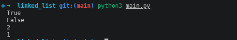

# Linked List Implementation in Python

A simple implementation of a **Singly Linked List** using Object-Oriented Programming (OOP) in Python. This project demonstrates how linked lists work internally by creating custom `Node` and `LinkedList` classes without relying on Python's built-in data structures.

## Overview

A linked list is a linear data structure where elements are stored in nodes. Each node contains:

* A value (data)
* A reference to the next node

Unlike arrays or Python lists, linked lists do not store elements in contiguous memory locations.

This project implements the fundamental operations of a singly linked list, including:

* Creating nodes
* Adding elements
* Removing elements
* Checking if the list is empty
* Tracking list length

## Features

* Object-Oriented Design
* Nested `Node` Class
* Dynamic Memory Allocation
* Element Insertion
* Element Deletion
* Empty List Detection
* Length Tracking

## Project Structure

```text
LinkedList
│
├── Node
│   ├── element
│   └── next
│
├── is_empty()
├── add()
└── remove()
```

## How It Works

### Creating a Linked List

```python
my_list = LinkedList()
```

### Adding Elements

```python
my_list.add(1)
my_list.add(2)
```

### Removing Elements

```python
my_list.remove(1)
```

### Checking if Empty

```python
print(my_list.is_empty())
```

## Example Usage

```python
my_list = LinkedList()

print(my_list.is_empty())

my_list.add(1)
my_list.add(2)

print(my_list.is_empty())
print(my_list.length)

my_list.remove(1)

print(my_list.length)
```

## Example Output

```text
True
False
2
1
```

## Concepts Demonstrated

This project demonstrates several important computer science and Python concepts:

* Data Structures
* Linked Lists
* Nodes
* Object-Oriented Programming (OOP)
* Classes and Objects
* Encapsulation
* Traversal Algorithms
* Dynamic Data Storage

## Time Complexity

| Operation   | Complexity |
| ----------- | ---------- |
| Add         | O(n)       |
| Remove      | O(n)       |
| Search      | O(n)       |
| Check Empty | O(1)       |

## Requirements

* Python 3.8+

## Running the Program

Clone the repository:

```bash
git clone https://github.com/ikwukao/linked_list.git
```

Navigate to the project directory:

```bash
cd linked-list-python
```

Run the program:

```bash
python3 main.py
```

## Learning Objectives

The goal of this project is to understand:

* How linked lists work internally
* How nodes are connected
* How insertion and deletion operations are performed
* The differences between linked lists and arrays
* Basic data structure implementation in Python

## Future Improvements

Possible enhancements include:

* Search functionality
* Insert at specific position
* Reverse linked list
* Doubly linked list implementation
* Iterator support
* String representation (`__str__`)
* Unit tests

## Author

Created as part of a Python Data Structures learning journey and freeCodeCamp coursework.

## License

This project is available for educational and personal use.

## Program Output Image


